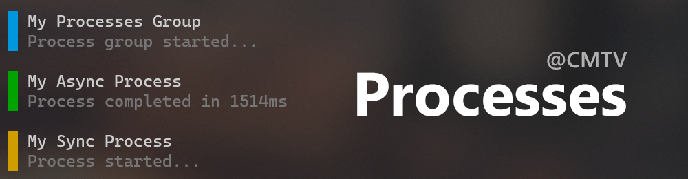

# Processes



## Install

```console
$ npm i @cmtv/processes
```

## About

With this package you can split a big process into smaller ones which are simply subclasses (called 'processes') of an abstract `SyncProcess` or `AsyncProcesses` classes.

Each process has a name and a method which is executed when process ran.
When a process done (or aborted with error) you will see informative messages in console.

## Example

Imagine you have to write a huge amount of code for building your project, site or whatever.
First of all split this big process into smaller ones. For example:

1. Clear `dist` directory
2. Build scripts
3. Build styles
4. Move files
...

Then, create separate 'process'-classes for each list item.
Every class have to implement `processName()` method where you return the name of the process and `process()` where you do what you want to do.

```js
// processes.ts

import { SyncProcess, AsyncProcess } from "@cmtv/processes";

export class Clear extends SyncProcess
{
    name = `Clearing 'dist' folder`;
    process() { /* Do something... */ }
}

export class Scripts extends AsyncProcess
{
    name = () => { return 'Building scripts'; }
    
    async process()
    {
        this.stage = 'TS -> JS';

        /* ... Doing stuff ... */
        
        this.stage = 'Accessing unexisting property';
        (null as any).property;
    }

    fail(e)
    {
        /* ... Handling error ... */
    }
}

// ...
```

Finally, you can create class and run all previously created processes!

```js
// build.ts

// Importing processes
import { Clear, Scripts } from "./processes";

(new Clear).run();
(new Scripts).run();
```